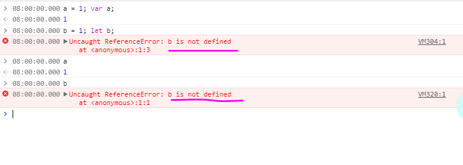
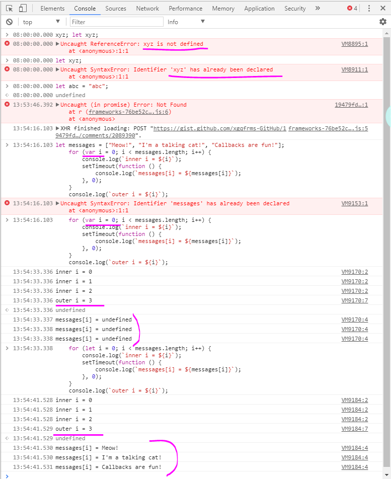

## var、let、const 区别


## 变量提升

```js

Hoisting 是您在JavaScript文档中找不到的术语。Hoisting 被认为是思考执行上下文（特别是创建和执行阶段）在JavaScript中如何工作的一般方式。但是，hoisting 可能会导致误解。例如，提升教导变量和函数声明被物理移动到编码的顶部，但这根本不是什么。真正发生的什么是在编译阶段将变量和函数声明放入内存中，但仍然保留在编码中键入的位置。

Note:  Hoisting 真正发生的是在编译阶段将变量和函数声明放入内存中，但仍然保留在编码中键入的位置。
了解更多
技术范例

JavaScript 在执行任何代码段之前，将函数声明放入内存中的优点之一是，这允许你可以在你的代码中使用一个函数，在声明该函数之前。

例如：

/**
* 正确的方式：先声明函数，再调用函数 (最佳实践)
*/
function catName(name) {
    console.log("My cat's name is " + name);
}

catName("Tigger");

/*
The result of the code above is: "My cat's name is Tigger"
*/


/*变量提升*/

foo = 2;
var foo;

// 被隐式地解释为:

var foo;
foo = 2;
上面的代码片段是你希望编写代码以使其工作的方式。现在，我们来看看当我们在写这个函数之前调用这个函数会发生什么：

/**
* 不推荐的方式：先调用函数，再声明函数 
*/

catName("Chloe");

function catName(name) {
    console.log("My cat's name is " + name);
}

/*
The result of the code above is: "My cat's name is Chloe"
*/

// 等价于

/*函数声明提升*/
function catName(name) {
    console.log("My cat's name is " + name);
}

catName("Tigger");

/*
The result of the code above is: "My cat's name is Chloe"
*/
即使我们先在代码中调用函数，在写该函数之前，代码仍然可以工作。这是因为在JavaScript中上下文如何执行的工作原理。

Hoisting 也适用于其他数据类型和变量。变量可以在声明之前进行初始化和使用。但是如果没有初始化，就不能使用它们。

技术范例

num = 6;
num + 7;
var num; 
/* 没有给出错误，只要声明了num */
JavaScript 仅提升声明，而不是初始化。如果你使用的是在使用后声明和初始化的一个变量，那么该值将是 undefined。以下两个示例演示了相同的行为。

var x = 1; 
// 声明 + 初始化 x

console.log(x + " " + y);  
// y 是未定义的

var y = 2;
// 声明 + 初始化 y


//上面的代码和下面的代码是一样的


var x = 1; 
// 声明 + 初始化 x

var y; 
// 声明 y

console.log(x + " " + y);  
//y 是未定义的

y = 2; 
// 初始化 y
 

技术参考

JavaScript: Understanding the Weird Parts - Udemy.com Course
var statement - MDN
function statement - MDN

```




随着ES6规范的到来,js 的定义变量已经有单纯的var  ，增加了 let const

 

# `let` 和 `var` 究竟有哪些具体的差异？

1. let 变量是块级作用域。其作用域只在块中，而不再是整个函数。
2. for (let x...) 循环将会给每次循环创建一个新的 x 绑定。
3. 任何尝试在 let 变量声明前使用变量将会抛出异常。(no hoisting ?)
4. 使用 let 重复声明变量将会引起 Syntax Error（语法错误）。
5. let 在严格模式是一个保留关键词，在非严格模式中，为了能够后向兼容，你任然可以使用 let 作为变量名、函数名和参数名.
   `var let = 'aHa';`

## Closures

> 闭包是指这样的*作用域*，它包含有一个*函数*，这个函数可以调用被这个作用域所*封闭*的变量、函数或者闭包等内容。
> 通常我们通过闭包所对应的函数来获得对闭包的访问。


```js
let messages = ["Meow!", "I'm a talking cat!", "Callbacks are fun!"];
    for (var i = 0; i < messages.length; i++) {
        console.log(`inner i = ${i}`);
        setTimeout(function () {
            console.log(`messages[i] = ${messages[i]}`);
        }, 0);
    }
    console.log(`outer i = ${i}`);


let messages = ["Meow!", "I'm a talking cat!", "Callbacks are fun!"];
    for (let i = 0; i < messages.length; i++) {
        console.log(`inner i = ${i}`);
        setTimeout(function () {
            console.log(`messages[i] = ${messages[i]}`);
        }, 0);
    }
    console.log(`outer i = ${i}`);
```

 


## const

1. const 声明的变量和 let 是一样的，但是你不能给他们赋值，否则将会抛出语法错误
2. 在声明 const 变量时, 给定初始值


https://hacks.mozilla.org/2015/07/es6-in-depth-let-and-const/ 以下 来自 英文 地址 自动翻译的

### `let` 是新的 `var`

在大多数情况下，JavaScript（其他编程语言，但*特别是* JavaScript）中的设计错误无法解决。向后兼容意味着从不改变Web上现有JS代码的行为。即使标准委员会也没有权力，可以用JavaScript自动分号插入来修复奇怪的怪癖。浏览器制造商根本不会执行突破性的更改，因为这种变化会惩罚他们的用户。

大概十年前，当布伦丹·艾奇（Brendan Eich）决定解决这个问题时，实际上只有一种方法。

他添加了一个新的关键字，`let`可以用来声明变量，就像`var`更好的范围规则一样。

看起来像这样：

``

```js
let t = readTachymeter();
```

``

或这个：

``

```js
for (let i = 0; i < messages.length; i++) {
  ...
}
```

``

`let`并且`var`是不同的，所以如果你只是在整个代码中进行全局搜索和替换，那可能会破坏你的代码的一部分（可能是无意的）依赖于这个怪癖`var`。但是，在大多数情况下，在新的ES6代码中，您应该停止使用`var`和使用`let`。所以口号：“ `let`是新的`var`”。

究竟是什么之间的差异`let`和`var`？很高兴你问！

- **let变量是块范围的。**声明的变量的范围`let`只是封闭的块，而不是整个封闭的函数。

  还有起重机`let`，但并不是一味的。这个`runTowerExperiment`例子可以简单地通过改变`var`来修正`let`。如果你`let`随处可见，你永远都不会有这样的错误。

- **全局let变量不是全局对象上的属性。**也就是说，你不会通过写作访问它们`window.variableName`。相反，它们生活在一个看不见的块的范围内，这个块看起来就是围绕在网页中运行的所有JS代码。

- **表单的循环在每次迭代中for (let x...)为x创建一个新的绑定。**

  这是一个非常微妙的区别。这意味着如果一个`for (let...)`循环执行多次，并且该循环包含一个闭包，就像在我们的说话的示例中，每个闭包将捕获循环变量的不同副本，而不是捕获相同循环变量的所有闭包。

  所以说话的猫的例子也可以通过改变`var`来修正`let`。

  这适用于所有三种`for`循环：[`for`-`of`](https://hacks.mozilla.org/2015/04/es6-in-depth-iterators-and-the-for-of-loop/)，`for`- `in`，以及具有分号的旧式C类。

- **尝试let在达到声明之前使用变量是一个错误。**变量未初始化，直到控制流达到其声明的代码行。例如：

  ``

  ```js
  function update() {
    console.log("current time:", t);  // ReferenceError
    ...
    let t = readTachymeter();
  }
  ```

  ``

  这个规则是帮助你捕捉错误的。而不是`NaN`结果，您会在问题所在的代码行上收到异常。

  变量在范围内但未初始化的这个时期称为时间死区。我一直在等待这个启发性的术语，使科幻飞跃。还没有。

  （Crunchy性能详细信息：在大多数情况下，您可以通过查看代码来判断声明是否已经运行，因此JavaScript引擎实际上不需要在每次访问变量时执行额外的检查，以确保它已被但是，在一个闭包中，有时候还不清楚，在这种情况下，JavaScript引擎会做一个运行时检查，这意味着`let`可以比一个慢于`var`。

  （Crunchy alternate-universe scoping details：在某些编程语言中，变量的范围从声明的起点开始，而不是向后覆盖整个封闭的块。标准委员会考虑使用这种范围规则`let`。方法，`t`这里引用一个ReferenceError 的用法根本不在后面的范围内`let t`，所以它根本不会引用该变量，它可以在一个封闭的范围内引用一个t，但是这种方法没有与关闭或功能提升工作良好，因此最终被放弃。）

- **重新声明的变量与let是一个SyntaxError。**

  这个规则也是帮助你检测到微不足道的错误。不过，这是最有可能给你带来一些问题，如果你试图在全球的差异`let`-到- `var`转换，因为它甚至适用于全局`let`变量。

  如果您有多个脚本都声明了相同的全局变量，那么最好继续使用`var`。如果切换到`let`，哪个脚本加载第二个将失败并出现错误。

  或使用ES6模块。但这是另一天的故事。

（Crunchy语法细节：`let`是严格模式代码中的保留字。在非严格模式代码中，为了向后兼容，您仍然可以声明名为`let`-you可以写的变量，函数和参数`var let = 'q';`！不是你会这样做那个，`let let;`根本不允许）

除了这些差异，`let`并且`var`都几乎相同。他们都支持声明由逗号分隔的多个变量，例如，它们都支持[解构](https://hacks.mozilla.org/2015/05/es6-in-depth-destructuring/)。

请注意，`class`声明的行为`let`不如`var`。如果你加载一个包含`class`多次的脚本，那么第二次你会收到一个重新声明该类的错误。

### `const`

对，还有一件事！

ES6还引入了您可以并用的第三个关键字`let`：`const`。

声明的变量`const`就像`let`除了你不能分配给它们，除了它们被声明之外。这是一个`SyntaxError`。

``

```js
const MAX_CAT_SIZE_KG = 3000; // 🙀

MAX_CAT_SIZE_KG = 5000; // SyntaxError
MAX_CAT_SIZE_KG++; // nice try, but still a SyntaxError
```

``

明智地，你不能声明一个`const`没有赋予它的价值。

``

```js
const theFairest;  // SyntaxError, you troublemaker

```