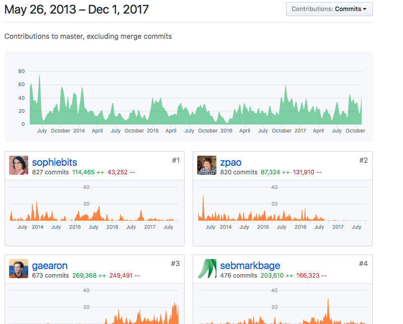

# 如何选择Redux的store和React的state？

话说react 代码贡献量最大的是位妹子。

对此没有“正确的”答案。有些用户更喜欢在Redux中保存每一个数据片段，以便始终保持应用程序的完全可序列化和受控版本。其他人则倾向于在组件的内部状态中保持非关键或UI状态，如“当前打开的下拉列表，按钮是否高亮”。

# 听听gaearon怎么说

 

在react中， 那些和全局状态无关的，短暂的状态，不会涉及的复杂的方式进行数据传递的，例如，在某个UI元素中切换，表单输入状态。可以使用react 的state

那些使用终极版来处理全局性的事情，或者以复杂的方式进行变异。例如，缓存的用户，全局弹窗状态的 可以放,

对于通过网络请求获取的数据，总是使用store来支持服务器端渲染（如果您认为这是最终目标）

都能放到redux 的store 里面，在Redux中的好处是状态可追踪，能随时CRUD

# 原则

The rule of thumb is: do whatever is less awkward

React 官方总结的 经验法则是：Redux是简化事情而不是复杂化，这是唯一的指导方针。

我想到的方式是，如果您使用Redux创建应用程序

**使用本地组件状态是好的**。作为一名开发人员，*您的*工作是确定组成您的应用程序的状态以及每个州应该在哪里生活。找到一个适合你的平衡点，并与之配合。

确定应该将什么类型的数据放入Redux的一些常见经验法则是：

- 应用程序的其他部分是否关心这些数据？
- 你需要能够根据这个原始数据创建更多的派生数据吗？
- 是否使用相同的数据来驱动多个组件？
- 能否将这个状态恢复到某个给定的时间点（例如，时间旅行调试）对你有价值吗？
- 你想缓存数据（即，如果它已经存在，而不是重新请求它，使用什么状态）？

有许多社区软件包实现了在Redux商店中存储每个组件状态的各种方法，例如[redux-ui](https://github.com/tonyhb/redux-ui)，[redux-component](https://github.com/tomchentw/redux-component)，[redux-react-local](https://github.com/threepointone/redux-react-local)等等。也可以将Redux的原则和reducer的概念应用到更新本地组件状态的任务中

`this.setState( (previousState) => reducer(previousState, someAction))`。

