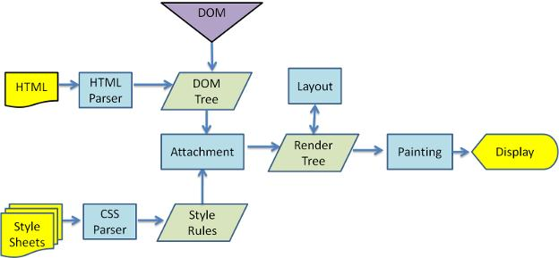

# 浏览器渲染原理

浏览器渲染展示网页的过程，老生常谈，面试必问，大致分为：

1. 解析HTML(HTML Parser)
2. 构建DOM树(DOM Tree)
3. 渲染树构建(Render Tree)
4. 绘制渲染树(Painting)

简单解释一下，通过请求得到的 HTML 经过解析（HTML parser）生成 DOM Tree。而在 CSS 解析完毕后，需要将解析的结果与 DOM Tree 的内容一起进行分析建立一棵 Render Tree，最终用来进行绘图（Painting）。

找到了一张很经典的图：

这个渲染过程作为一个基础知识，继续往下深入。

当页面加载并解析完毕后，它在浏览器内代表了一个大家十分熟悉的结构：DOM（Document Object Model，文档对象模型）。在浏览器渲染一个页面时，它使用了许多没有暴露给开发者的中间表现形式，其中最重要的结构便是层(layer)。

这个层就是本文重点要讨论的内容：

而在 Chrome 中，存在有不同类型的层： RenderLayer(负责 DOM 子树)，GraphicsLayer(负责 RenderLayer 的子树)。接下来我们所讨论的将是 GraphicsLayer 层。

GraphicsLayer 层是作为纹理(texture)上传给 GPU 的。

## **回流（reflow）与重绘（repaint）**

这里首先要分清两个概念，重绘与回流。

### **回流（reflow）**

当渲染树（render Tree）中的一部分(或全部)因为元素的规模尺寸，布局，隐藏等改变而需要重新构建。这就称为回流（reflow），也就是重新布局（relayout）。

每个页面至少需要一次回流，就是在页面第一次加载的时候。在回流的时候，浏览器会使渲染树中受到影响的部分失效，并重新构造这部分渲染树，完成回流后，浏览器会重新绘制受影响的部分到屏幕中，该过程成为重绘。

### **重绘（repaint）**

当render tree中的一些元素需要更新属性，而这些属性只是影响元素的外观，风格，而不会影响布局的，比如 background-color 。则就叫称为重绘。

值得注意的是，回流必将引起重绘，而重绘不一定会引起回流。

明显，回流的代价更大，简单而言，当操作元素会使元素修改它的大小或位置，那么就会发生回流。

### **回流何时触发：**

- 调整窗口大小（Resizing the window）
- 改变字体（Changing the font）
- 增加或者移除样式表（Adding or removing a stylesheet）
- 内容变化，比如用户在input框中输入文字（Content changes, such as a user typing text in
- an input box）
- 激活 CSS 伪类，比如 :hover (IE 中为兄弟结点伪类的激活)（Activation of CSS pseudo classes such as :hover (in IE the activation of the pseudo class of a sibling)）
- 操作 class 属性（Manipulating the class attribute）
- 脚本操作 DOM（A script manipulating the DOM）
- 计算 offsetWidth 和 offsetHeight 属性（Calculating offsetWidth and offsetHeight）
- 设置 style 属性的值 （Setting a property of the style attribute）

所以对于页面而言，我们的宗旨就是尽量减少页面的回流重绘，简单的一个栗子：

上面四句，因为涉及了 offsetHeight 操作，浏览器强制 reflow 了两次，而下面四句合并了 offset 操作，所以减少了一次页面的回流。 

减少回流、重绘其实就是需要减少对渲染树的操作（合并多次多DOM和样式的修改），并减少对一些style信息的请求，尽量利用好浏览器的优化策略。

### **flush队列**

其实浏览器自身是有优化策略的，如果每句 Javascript 都去操作 DOM 使之进行回流重绘的话，浏览器可能就会受不了。所以很多浏览器都会优化这些操作，浏览器会维护 1 个队列，把所有会引起回流、重绘的操作放入这个队列，等队列中的操作到了一定的数量或者到了一定的时间间隔，浏览器就会 flush 队列，进行一个批处理。这样就会让多次的回流、重绘变成一次回流重绘。

但是也有例外，因为有的时候我们需要精确获取某些样式信息，下面这些：

- offsetTop, offsetLeft, offsetWidth, offsetHeight

- scrollTop/Left/Width/Height

- clientTop/Left/Width/Height

- width,height

- 请求了getComputedStyle(), 或者 IE的 currentStyle

这个时候，浏览器为了反馈最精确的信息，需要立即回流重绘一次，确保给到我们的信息是准确的，所以可能导致 flush 队列提前执行了。

### **display:none 与 visibility:hidden 的异同**

两者都可以在页面上隐藏节点。不同之处在于，

- display:none 隐藏后的元素不占据任何空间。它的宽度、高度等各种属性值都将“丢失”
- visibility:hidden 隐藏的元素空间依旧存在。它仍具有高度、宽度等属性值

从性能的角度而言，即是回流与重绘的方面，

- display:none  会触发 reflow（回流）
- visibility:hidden  只会触发 repaint（重绘），因为没有发现位置变化

他们两者在优化中 visibility:hidden 会显得更好，因为我们不会因为它而去改变了文档中已经定义好的显示层次结构了。

对子元素的影响：

- display:none 一旦父节点元素应用了 display:none，父节点及其子孙节点元素全部不可见，而且无论其子孙元素如何设置 display 值都无法显示；
- visibility:hidden 一旦父节点元素应用了 visibility:hidden，则其子孙后代也都会全部不可见。不过存在隐藏“失效”的情况。当其子孙元素应用了 visibility:visible，那么这个子孙元素又会显现出来。

### **使用 transform3d api 代替 transform api，强制开始 GPU 加速**

GPU 能够加速 Web 动画，这个上文已经反复提到了。

3D transform 会启用GPU加速，例如 translate3D, scaleZ 之类，当然我们的页面可能并没有 3D 变换，但是不代表我们不能启用 GPU 加速，在非 3D 变换的页面也使用 3D transform 来操作，算是一种 hack 加速法。我们实际上不需要z轴的变化，但是还是假模假样地声明了，去欺骗浏览器。

